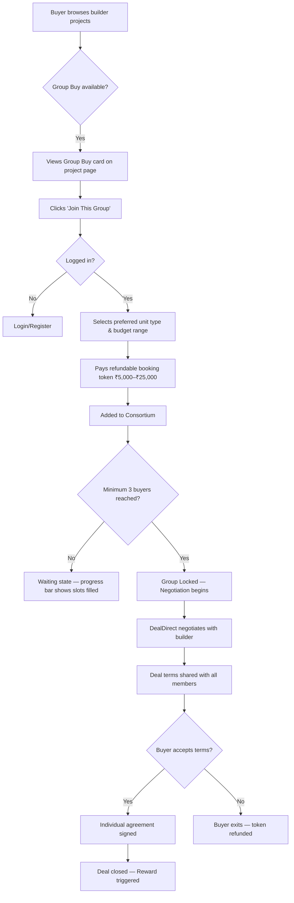
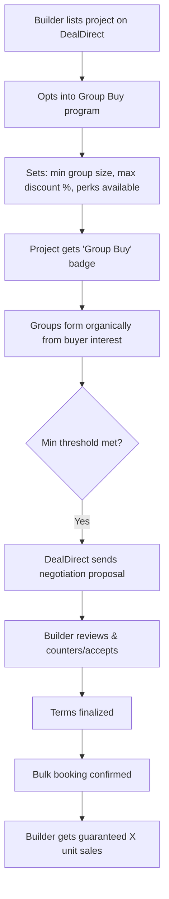

# DealDirect — Group Buying Feature Proposal

> **Date:** June 6, 2026  
> **Prepared by:** DealDirect Product Team  
> **Status:** Awaiting Client Approval

---

## What is Group Buying?

Group Buying allows **3 to 10 home buyers** interested in the same residential project to come together as a consortium. By pooling their demand, they negotiate directly with the builder for **bulk discounts, waived brokerage, and premium perks** — savings that no individual buyer could achieve alone.

DealDirect acts as the **trusted intermediary** — forming groups, managing the negotiation, and ensuring every buyer gets a fair, transparent deal.

---

## Why This Matters

### For Buyers

| Benefit | Details |
|---------|---------|
| **5–25% off base price** | Bulk demand gives serious negotiating power |
| **Zero brokerage** | Platform refunds or waives broker commissions |
| **Better perks** | Free parking, floor upgrades, zero maintenance for Year 1 |
| **Individual ownership** | Each buyer signs their own agreement — full control over flat selection |
| **Refundable commitment** | Booking token is fully refundable if the buyer exits before deal closure |

### For Builders

| Benefit | Details |
|---------|---------|
| **Guaranteed bulk sales** | 3–10 units sold in one transaction |
| **Reduced marketing cost** | DealDirect brings the demand — no ad spend needed |
| **Faster project closure** | Multiple bookings accelerate cash flow |
| **Higher trust** | DealDirect's verified buyer pool reduces time-wasters |

### For DealDirect

| Benefit | Details |
|---------|---------|
| **New revenue stream** | Platform fee on every closed group deal |
| **Deeper builder relationships** | Builders see DealDirect as a sales partner, not just a listing site |
| **Buyer retention** | Unique feature that competitors don't offer |
| **Marketplace network effect** | More groups → more builders opt in → more buyers join |

---

## How It Works

### Buyer Journey

### Builder Journey

### Admin Journey

| Action | Description |
|--------|-------------|
| **Monitor Groups** | See all active consortiums, member count, fill rate |
| **Manage Negotiations** | Track offer/counter-offer chain per group |
| **Approve Deals** | Final sign-off before terms go to buyers |
| **Handle Refunds** | Process token refunds for buyers who exit |
| **Analytics** | Total savings delivered, groups closed, conversion rate |

### Key Rules

- **Group size:** Minimum 3, maximum 10 buyers per project
- **Deadline:** 30 days to fill a group (auto-refund if not met)
- **Token:** ₹5,000 – ₹25,000 (refundable, adjusted against booking on deal closure)
- **Negotiation:** Up to 3 rounds of offer and counter-offer between DealDirect and the builder
- **Deal closure:** When 75%+ of group members accept the final terms

---

## Where It Lives on DealDirect

| Location | What the User Sees |
|----------|-------------------|
| **Main navigation bar** | New "Group Buy" tab — direct access to all active group buy projects |
| **Property listing cards** | "Group Buy Available" badge on eligible builder projects |
| **Property detail page** | Dedicated section showing group progress, savings estimate, and a "Join This Group" button |
| **Builder profile page** | "Group Buy Projects" section listing all their group-buy-enabled projects |
| **User dashboard** | "My Groups" tab — track active consortiums, see deal status, manage participation |
| **Notifications** | Real-time updates when a group fills up, negotiation progresses, or a deal closes |

---

## Revenue Model

| Model | How It Works |
|-------|-------------|
| **Platform fee (recommended)** | DealDirect charges the builder 1–2% of each unit's sale price on deal closure |
| **Fixed referral fee (alternative)** | A flat per-unit fee (e.g., ₹50,000–₹1,00,000) negotiated with each builder |
| **Hybrid** | Lower platform % + small buyer convenience fee (e.g., ₹2,000) |

> **Projected revenue (first 3 months):** ₹5–10 Lakh based on 15 closed group deals averaging ₹50L per unit.

---

## Delivery Timeline

| Phase | Duration | What Gets Delivered |
|-------|----------|---------------------|
| **Phase 1 — Foundation** | Day 1–5 | Group Buy project listings visible to buyers. Builders can create group buy offers. Basic "express interest" flow. |
| **Phase 2 — Payments & Groups** | Day 6–10 | Token payment integration. Real group formation with progress tracking. Refund flow for exits. "My Groups" in user dashboard. |
| **Phase 3 — Negotiation** | Day 11–16 | Admin-managed negotiation pipeline. Builder counter-offer flow. Deal acceptance by buyers. Notifications at every stage. |
| **Phase 4 — Polish & Launch** | Day 17–21 | Savings calculator on landing page. Reward integration for closed deals. Mobile optimization. Full testing and launch. |

> **Total estimated delivery: 3 weeks** from approval.

---

## Risk Mitigation

| Risk | What Could Happen | How We Handle It |
|------|-------------------|-----------------|
| **Low buyer interest** | Groups don't fill up | Launch with 3–5 popular projects first. Show "X people interested" to create urgency. Social proof drives participation. |
| **Builders hesitate** | No supply of group buy projects | Onboard a few builder partners before launch with a free trial period. Show them the guaranteed-sales pitch. |
| **Payment disputes** | Buyers want refunds or contest charges | Clear refund policy displayed upfront. Automated refund processing on exit. Token held in escrow until deal closes. |
| **Inactive group members** | People join and go silent | Automated reminders at Day 7, 14, and 21. Auto-expiry at Day 30 with full refund. |
| **Trust concerns** | Buyers unsure about group dynamics | Each buyer signs an individual agreement. DealDirect's existing verification system applies. Full transparency on pricing. |

---

## Success Metrics (3 Months Post-Launch)

| Metric | Target |
|--------|--------|
| Groups formed | 50+ |
| Groups successfully closed | 15+ (30% conversion) |
| Average savings per buyer | ₹2–5 Lakh |
| Platform revenue | ₹5–10 Lakh |
| Builder adoption | 10+ active projects |
| Buyer satisfaction (NPS) | 8+ out of 10 |

---

## What Makes This Different

This isn't a standalone group-buying app. It's built **inside DealDirect's existing ecosystem**:

- Buyers already browsing properties get introduced to group deals naturally
- Builders already listed on DealDirect can opt in with minimal effort
- The existing reward system celebrates group deal closures
- DealDirect's verification and trust layer applies to every group member

**Group Buying turns DealDirect from a listing platform into a demand aggregation engine** — a fundamentally stronger position in the market.

---

## Decisions Needed from Client

1. **Token amount range** — ₹5K–₹25K or different?
2. **Revenue model** — Platform fee %, fixed referral, or hybrid?
3. **Group size limits** — 3–10 or adjusted?
4. **Deal closure threshold** — 75% member acceptance or higher?
5. **Launch strategy** — Start with specific cities/builders or platform-wide?

---

> **Next step:** Client signs off on scope → We finalize Phase 1 sprint → Development begins.
